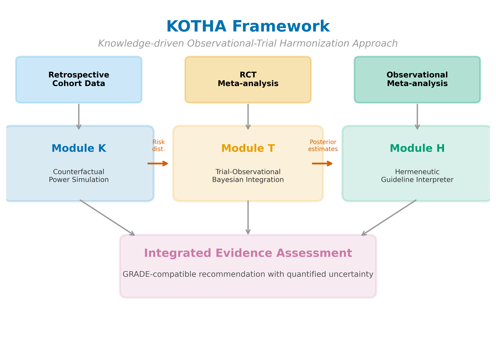
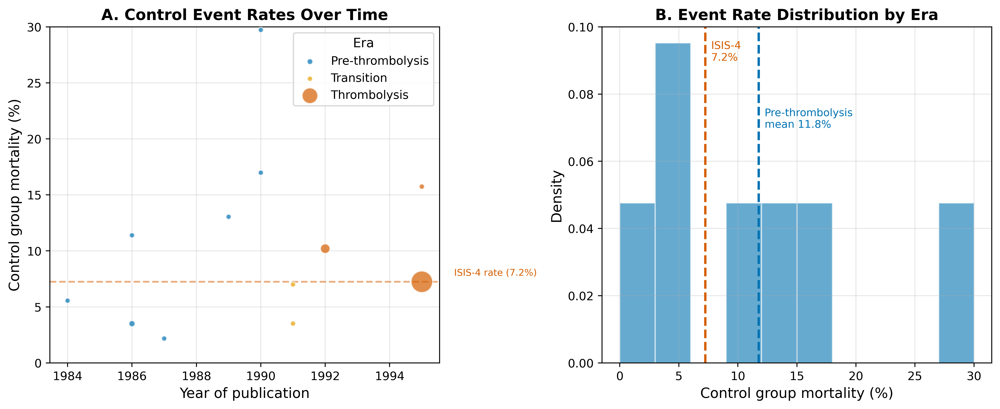
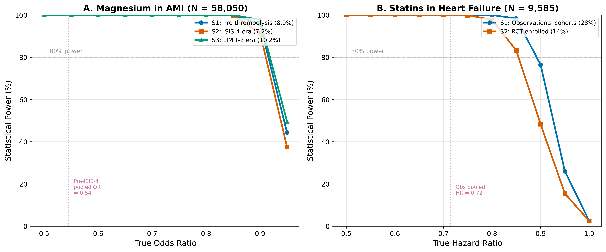
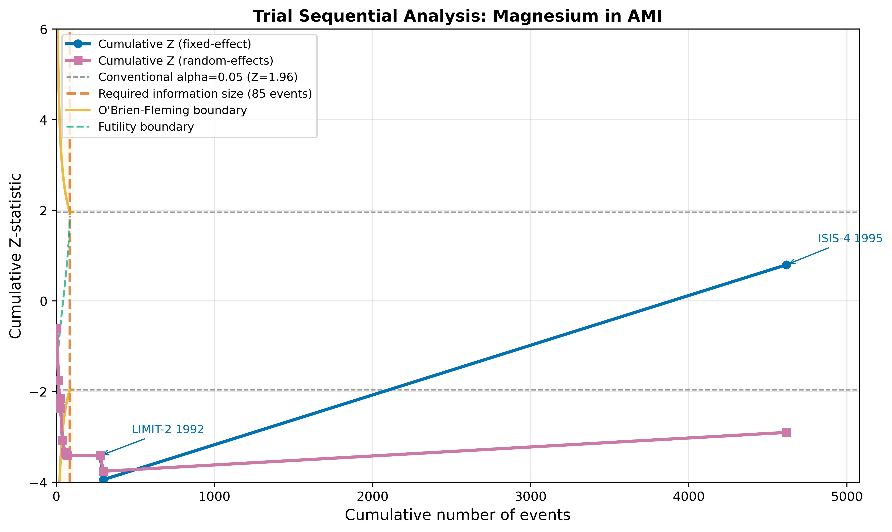
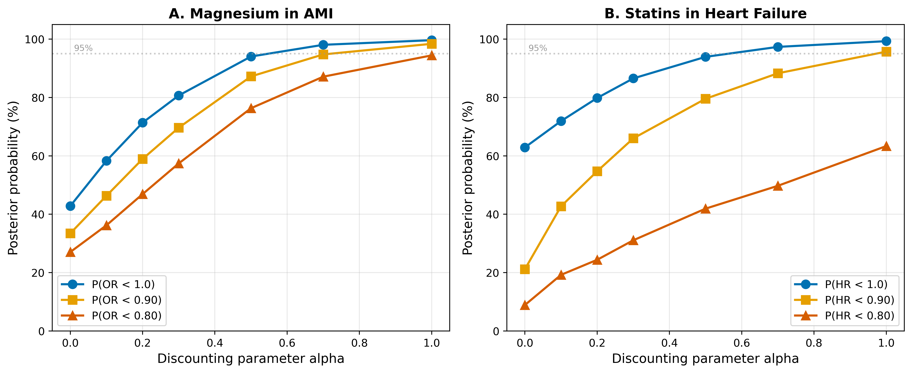
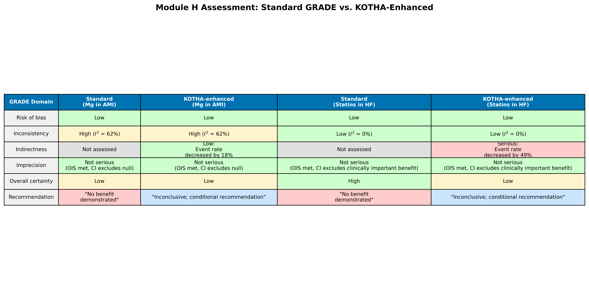

## Abstract

**Background**: Evidence-based medicine places randomized controlled trials (RCTs) and their meta-analyses at the top of the evidence hierarchy [1]. Discordance between observational and RCT evidence is often attributed to confounding, but an underexplored structural explanation is that trial enrollment progressively excludes higher-risk patients, diluting event rates and reducing statistical information. We developed the Knowledge-driven Observational-Trial Harmonization Approach (KOTHA) Framework to diagnose and address this structural information loss.

**Methods**: KOTHA comprises three modules. Module K uses counterfactual power simulation to quantify how enrollment-driven risk-profile shifts alter statistical power. Module T integrates RCT and observational evidence through hierarchical Bayesian meta-analysis with power-prior discounting. Module H translates these outputs into a structured GRADE-compatible evidence assessment. We illustrated the framework using published data from two cases of observational-RCT divergence: intravenous magnesium in acute myocardial infarction (12 trials, 1984-1995) and statins in heart failure (5 observational studies, 2 RCTs).

**Results**: In the magnesium case, control event rates fell from 8.9% (pre-thrombolysis era) to 7.2% (ISIS-4). The pre-ISIS-4 meta-analysis yielded OR = 0.54 (95% CI: 0.40-0.75), while the all-trials estimate was OR = 0.56 (0.38-0.83) with $I^2$ = 62%. In the statins case, observational studies showed HR = 0.72 (0.64-0.80) and RCTs showed HR = 0.97 (0.90-1.05), with an RCT-to-observational event rate ratio of 0.53. Bayesian integration with moderate discounting ($\alpha$ = 0.3) yielded OR = 0.73 (95% CrI: 0.28-2.09), P(OR < 1) = 77% for magnesium and HR = 0.85 (0.59-1.57), P(HR < 1) = 84% for statins. Module H reclassified both cases as informationally inconclusive with serious indirectness.

**Conclusions**: The KOTHA Framework provides a reproducible, quantitative method to distinguish "evidence of no effect" from "no evidence of effect" and to inform trial design, evidence synthesis, and guideline interpretation.

**Keywords**: randomized controlled trials, meta-analysis, observational studies, trial design, counterfactual simulation, Bayesian evidence synthesis, power analysis, GRADE, magnesium, statins, heart failure

## Abbreviations

| Abbreviation | Definition |
|---|---|
| ADEMP | Aims, Data-generating mechanisms, Estimands, Methods, Performance measures |
| AMI | Acute myocardial infarction |
| CrI | Credible interval |
| CI | Confidence interval |
| EBM | Evidence-based medicine |
| GRADE | Grading of Recommendations Assessment, Development and Evaluation |
| HF | Heart failure |
| HR | Hazard ratio |
| KOTHA | Knowledge-driven Observational-Trial Harmonization Approach |
| MCMC | Markov chain Monte Carlo |
| OIS | Optimal information size |
| OR | Odds ratio |
| RCT | Randomized controlled trial |
| TSA | Trial sequential analysis |

## Introduction

Evidence-based medicine places RCTs and their meta-analyses at the apex of the evidence hierarchy because randomization minimizes confounding and provides internally valid estimates of treatment effects [1]. Nevertheless, meta-analyses of observational studies and RCTs frequently disagree: observational evidence may show statistically significant benefit while RCT evidence does not [2-3]. The conventional explanation invokes residual confounding, selection bias, or publication bias in observational data. While these sources of bias are real, they may not fully account for the discordance.

An alternative, structural explanation deserves systematic attention. RCT enrollment criteria, consent processes, and site selection progressively restrict the study population [4-5]. Because clinical events are concentrated in the highest-risk patients---those with comorbidities, advanced disease, or organ dysfunction---their exclusion lowers event rates in the enrolled cohort. If trial protocols do not compensate by increasing sample size, extending follow-up, or enriching high-risk enrollment, the resulting evidence base can become informationally insufficient. We term this phenomenon **structural information loss**, a five-step causal chain: representativeness loss; event concentration in excluded populations; inadequate design compensation; systematic underpowering; and, ultimately, distorted recommendations when "no statistically significant difference" is interpreted as "no effect".

The concepts of optimal information size (OIS) and trial sequential analysis (TSA) provide partial remedies. OIS recognizes that meta-analyses, like individual trials, require a minimum information size to reach reliable conclusions [6-7]. TSA applies sequential monitoring boundaries to cumulative meta-analysis, distinguishing evidence of no effect (futility boundary crossed) from no evidence of effect (boundary not crossed) [8-9]. However, these tools are underused in guideline development, and neither directly quantifies the information loss attributable to enrollment-driven risk-profile shifts.

A number of trial design strategies can mitigate event dilution (Table 1), including stratified randomization, prognostic enrichment, event-driven designs, adaptive sample-size re-estimation, and pragmatic or registry-based trials. Yet no existing framework integrates prospective power assessment, retrospective diagnostic evaluation, and structured evidence interpretation for completed or planned RCTs.

We therefore developed the Knowledge-driven Observational-Trial Harmonization Approach (KOTHA) Framework. It is a three-module system that (1) diagnoses structural information loss through counterfactual power simulation (Module K), (2) integrates discordant evidence through hierarchical Bayesian meta-analysis (Module T), and (3) translates quantitative findings into GRADE-compatible evidence assessment (Module H). This paper describes the framework and illustrates its application to two canonical cases of observational-RCT divergence, with an emphasis on implications for clinical trial design.

**Table 1: Existing approaches to mitigate event dilution in RCTs**

| Approach | Mechanism | Adoption level |
|---|---|---|
| Stratified randomization | Risk-based stratification of randomization and analysis | Common for basic strata; rare for event-rate-driven strata |
| Prognostic enrichment | Intentional enrollment of high-risk patients to increase event rates | Endorsed by FDA and EMA guidance; limited in non-drug trials |
| Event-driven design | Continue enrollment/follow-up until target event count is reached | Common in cardiology and oncology; rare in other specialties |
| Adaptive sample size re-estimation | Mid-trial re-estimation of required sample size based on observed event rates | Statistically powerful; regulatory complexity limits adoption |
| External data-informed design | Use retrospective data to quantify expected event loss and adjust design | Ideal but very rare in practice |
| Pragmatic / registry-based trials | Broad eligibility, minimal exclusions, real-world enrollment | Growing (e.g., REMAP-CAP, RECOVERY) but not yet standard |

## Methods

### Overview

The KOTHA Framework comprises three interconnected modules (Fig. 1). Module K (Counterfactual Power Simulation) quantifies how enrollment-driven risk-profile shifts reduce statistical power. Module T (Trial-Observational Bayesian Integration) combines RCT and observational evidence with explicit discounting for design-related bias. Module H (Hermeneutic Guideline Interpreter) translates module outputs into a structured GRADE assessment. Each module can be used independently, but the framework is most informative when applied in sequence.

### Module K: Counterfactual power simulation

Module K asks: if the RCTs in a meta-analysis had enrolled patients with the risk profile of the real-world target population, would the combined evidence have been sufficient to detect the effect suggested by observational studies? The simulation component follows the ADEMP reporting structure [10].

We define three enrollment scenarios: S1 (real-world target population, approximated by a representative retrospective cohort or published aggregate event rates); S2 (RCT-enrolled equivalent, defined by applying published eligibility criteria to the retrospective cohort or using observed RCT event rates); and S3 (design-optimized, incorporating prognostic enrichment).

For each scenario, we compute the expected control event rate $p_c$ and treatment event rate $p_t = (p_c \cdot \text{OR}) / (1 - p_c + p_c \cdot \text{OR})$. The total expected number of events is $D = N(p_c + p_t)/2$ for a trial of $N$ patients randomized 1:1. Under the Schoenfeld approximation [11], the standard error of the log-OR is approximately $2/\sqrt{D}$, yielding the power function

$$\text{Power} = \Phi\left( |\log(\text{OR})| \cdot \sqrt{D} / 2 - z_{\alpha/2} \right)$$

where $\Phi$ is the standard normal cumulative distribution function. The ratio $\rho = p_c^{(S2)} / p_c^{(S1)}$ quantifies event dilution. Module K reports power across a grid of assumed true effects and computes the sample size required to reach 80% power under each scenario.

### Module T: Hierarchical Bayesian evidence integration

When Module K indicates that RCT evidence is informationally insufficient, Module T combines RCT and observational evidence while explicitly modeling design-specific bias. Let $y_i$ denote the reported log effect size from study $i$ with standard error $s_i$. The model is $y_i \sim \text{Normal}(\theta_i, s_i^2)$ and $\theta_i = \mu + u_i + b_i$, where $\mu$ is the overall effect, $u_i \sim \text{Normal}(0, \tau^2)$ captures between-study heterogeneity, and $b_i$ captures design-specific bias. Alternative effect measures such as restricted mean survival time can be substituted when proportional-hazards assumptions are questionable [12-13]. Evidence-based priors have been proposed to anchor historical expectations while limiting prior-data conflict [14]. We use power-prior discounting [15] to down-weight observational evidence by a factor $\alpha \in [0, 1]$ and also present bias-adjusted normal-approximation analyses. Posterior distributions are obtained by Metropolis-Hastings MCMC (15,000 post-warmup iterations after 3,000 warmup) for each $\alpha$ in $(0, 0.1, 0.2, 0.3, 0.5, 0.7, 1.0)$.

### Module H: Guideline interpretation

Module H maps the outputs of Modules K and T onto the GRADE framework [1]. It includes five assessments (Table 2): information sufficiency (OIS vs observed events), confidence interval interpretation, representativeness (event rate ratio), TSA boundary status, and recommended language. The result is a KOTHA-enhanced certainty rating and recommendation that explicitly distinguishes "evidence of effect," "evidence of no effect," and "no evidence of effect (inconclusive)."

### Data sources and statistical analysis

For magnesium in AMI we used study-level event counts extracted from published overviews [16-17]. For statins in heart failure we used aggregate data from five observational cohorts [18-22] and two RCTs [23-24]. We used DerSimonian-Laird random-effects meta-analysis and computed 95% confidence intervals. OIS and TSA were calculated using standard formulas [6-9]. All analyses were performed with the Python code in the public repository.

**Fig. 1** Overview of the KOTHA Framework. Module K (Counterfactual Power Simulation) quantifies risk-profile shift and estimates power under counterfactual enrollment scenarios. Module T (Bayesian Evidence Integration) combines RCT and observational evidence using power-prior discounting. Module H (Guideline Interpreter) synthesizes outputs into a structured GRADE-compatible assessment.

**Table 2: Module H assessment checklist mapped to GRADE domains**

| Module H assessment | GRADE domain | Analytical tool | Decision criterion |
|---|---|---|---|
| Information sufficiency | Imprecision | OIS calculation | Total events < OIS: informationally insufficient |
| CI assessment | Imprecision | CI inspection | CI spans benefit through null: inconclusive |
| Representativeness | Indirectness | Module K event rate ratio | Event rate ratio > 1.5 or < 0.67: indirectness concern |
| TSA | Imprecision | Sequential monitoring boundaries | Boundaries not crossed: interim analysis equivalent |
| Recommendation language | Overall assessment | Standardized templates | Tailored to information sufficiency classification |

## Results

### Study-level data and risk-profile shift

Study-level data are summarized in Table 3 (magnesium in AMI) and Table 4 (statins in HF). In the magnesium case, control-group mortality fell from a pre-thrombolysis weighted mean of 8.9% to 7.2% in ISIS-4, an event rate ratio of 0.82 (Fig. 2). In the statins case, the RCT-to-observational event rate ratio was 0.53, indicating that the RCT populations had roughly half the mortality event rate of the observational cohorts.

**Table 3: Study-level data for magnesium in AMI**

| Study | Year | Era | Events (Mg) | N (Mg) | Events (Ctrl) | N (Ctrl) | Control rate |
|---|---|---|---|---|---|---|---|
| Morton 1984 | 1984 | Pre-thrombolysis | 1 | 40 | 2 | 36 | 5.6% |
| Rasmussen 1986 | 1986 | Pre-thrombolysis | 1 | 56 | 9 | 79 | 11.4% |
| Smith 1986 | 1986 | Pre-thrombolysis | 2 | 200 | 7 | 200 | 3.5% |
| Abraham 1987 | 1987 | Pre-thrombolysis | 1 | 48 | 1 | 46 | 2.2% |
| Ceremuzynski 1989 | 1989 | Pre-thrombolysis | 1 | 25 | 3 | 23 | 13.0% |
| Shechter 1990 | 1990 | Pre-thrombolysis | 1 | 50 | 9 | 53 | 17.0% |
| Singh 1990 | 1990 | Pre-thrombolysis | 6 | 39 | 11 | 37 | 29.7% |
| Feldstedt 1991 | 1991 | Transition | 4 | 100 | 7 | 100 | 7.0% |
| Schechter 1991 | 1991 | Transition | 1 | 59 | 2 | 57 | 3.5% |
| LIMIT-2 1992 | 1992 | Thrombolysis | 90 | 1,159 | 118 | 1,157 | 10.2% |
| Shechter 1995 | 1995 | Thrombolysis | 4 | 107 | 17 | 108 | 15.7% |
| ISIS-4 1995 | 1995 | Thrombolysis | 2216 | 29,011 | 2103 | 29,039 | 7.2% |

**Table 4: Study-level data for statins in heart failure**

| Study | Design | HR (95% CI) | N | Events |
|---|---|---|---|---|
| Mozaffarian 2004 | OBS | 0.62 (0.49--0.78) | 1,153 | 356 |
| Horwich 2004 | OBS | 0.59 (0.44--0.78) | 551 | 189 |
| Go 2006 | OBS | 0.69 (0.63--0.75) | 24,598 | 5,765 |
| Foody 2006 | OBS | 0.82 (0.79--0.85) | 54,960 | 16,573 |
| Anker 2006 | OBS | 0.75 (0.66--0.85) | 10,510 | 2,890 |
| CORONA 2007 | RCT | 0.95 (0.86--1.05) | 5,011 | 728 |
| GISSI-HF 2008 | RCT | 1.00 (0.90--1.12) | 4,574 | 657 |

**Fig. 2** Risk-profile shift in the magnesium-in-AMI case. (A) Control-group mortality rates over time, with bubble size proportional to study sample size and colors indicating era. (B) Weighted mean control mortality by era.

### Counterfactual power simulation

At the ISIS-4 sample size (N = 58,050) and the pre-ISIS-4 pooled effect (OR = 0.54), power exceeded 99% under all three event-rate scenarios. For a more modest effect (OR = 0.90), however, power was 95.8% under the pre-thrombolysis rate and 91.5% under the ISIS-4 rate (Fig. 3A). For statins, power to detect the observational effect (HR = 0.72) was 100.0% under the observational event rate and 99.1% under the RCT event rate; for a more modest effect (HR = 0.85), power fell from 84.6% to 58.3%---a 26 percentage-point reduction attributable to event dilution (Fig. 3B).

**Fig. 3** Estimated power by enrollment scenario and true effect size. (A) Magnesium in AMI at the ISIS-4 sample size (N = 58,050). (B) Statins in HF at the combined RCT sample size (N = 9,585). S1 = real-world/observational event rate; S2 = RCT event rate; S3 = intermediate/enriched rate. Horizontal dashed lines indicate 80% power.

### Frequentist meta-analysis and trial sequential analysis

Random-effects meta-analysis of the 11 pre-ISIS-4 magnesium trials yielded OR = 0.54 (95% CI: 0.40-0.75) with $I^2$ = 6%. Adding ISIS-4 changed the pooled estimate to OR = 0.56 (0.38-0.83), but heterogeneity increased to $I^2$ = 62% (Fig. 4). TSA under a fixed-effect accumulation produced a final cumulative $Z$ of 0.80, below the conventional boundary of 1.96; under a random-effects accumulation the final $Z$ was -2.90, crossing the O'Brien-Fleming boundary of 0.27 (Fig. 5). This divergence reflects era-dependent treatment-effect heterogeneity driven by the ISIS-4 result.

**Fig. 4** Forest plot for magnesium in AMI. Individual study odds ratios are shown with 95% confidence intervals, color-coded by era. Pooled estimates include frequentist random-effects (pre-ISIS-4 and all trials) and Bayesian integrated estimates at selected discounting levels ($\alpha$ = 0.3, 0.5, 1.0).

**Fig. 5** Trial sequential analysis for magnesium in AMI. The cumulative Z-curve is plotted against cumulative events. Vertical dashed line indicates the optimal information size (OIS). Curved lines show O'Brien-Fleming monitoring boundaries.

For statins, observational studies showed a pooled HR of 0.72 (95% CI: 0.64-0.80) with $I^2$ = 82%, whereas the two RCTs (CORONA and GISSI-HF) yielded HR = 0.97 (0.90-1.05) with $I^2$ = 0% (Fig. 6).

**Fig. 6** Forest plot for statins in heart failure. Individual study hazard ratios are shown with 95% confidence intervals, grouped by design. Pooled estimates include design-specific frequentist pooling and KOTHA-integrated estimates at selected discounting levels ($\alpha$ = 0.1, 0.3, 0.5).

### Bayesian integration

Bayesian integration (Table 5) showed that for magnesium, with $\alpha$ = 0 (ISIS-4 only), the posterior median OR was 1.11 with 30.6% probability of benefit. With $\alpha$ = 0.3 the posterior shifted to OR = 0.73 (95% CrI: 0.28-2.09), with 77% probability of benefit (Fig. 7A). For statins (Table 6), with $\alpha$ = 0 (RCTs only) the posterior probability of benefit was 60.9% and the probability of a clinically meaningful benefit (HR < 0.90) was 17.7%. With $\alpha$ = 0.3 these probabilities rose to 83.7% and 65.7%, respectively (Fig. 7B). Even with moderate borrowing from observational evidence, conclusions remained uncertain.

**Table 5: Bayesian integration --- Magnesium in AMI (power prior)**

| $\alpha$ | OR (95% CrI) | P(OR < 1) | P(OR < 0.90) | P(OR < 0.80) |
|---|---|---|---|---|
| 0.0 (ISIS-4 only) | 1.11 (0.43--7.03) | 30.6% | 22.2% | 16.2% |
| 0.1 | 1.00 (0.31--3.51) | 50.7% | 36.6% | 27.9% |
| 0.2 | 0.85 (0.31--2.50) | 66.5% | 55.0% | 45.8% |
| 0.3 | 0.73 (0.28--2.09) | 77.0% | 66.3% | 56.9% |
| 0.5 | 0.61 (0.28--1.30) | 92.6% | 87.3% | 77.1% |
| 0.7 | 0.57 (0.29--1.05) | 96.6% | 94.1% | 87.4% |
| 1.0 (full weight) | 0.54 (0.32--0.91) | 98.7% | 97.2% | 93.5% |

**Table 6: Bayesian integration --- Statins in HF (power prior)**

| $\alpha$ | HR (95% CrI) | P(HR < 1) | P(HR < 0.90) | P(HR < 0.80) |
|---|---|---|---|---|
| 0.0 (RCTs only) | 0.98 (0.63--2.35) | 60.9% | 17.7% | 9.1% |
| 0.1 | 0.92 (0.63--2.19) | 70.4% | 43.5% | 17.7% |
| 0.2 | 0.88 (0.60--1.80) | 78.4% | 57.0% | 26.0% |
| 0.3 | 0.85 (0.59--1.57) | 83.7% | 65.7% | 32.8% |
| 0.5 | 0.82 (0.62--1.15) | 91.9% | 79.2% | 42.5% |
| 0.7 | 0.79 (0.63--1.02) | 96.8% | 88.7% | 53.4% |
| 1.0 (full weight) | 0.78 (0.65--0.95) | 99.1% | 94.8% | 64.1% |

**Fig. 7** Sensitivity analysis of Bayesian integration to the discounting parameter $\alpha$. (A) Magnesium in AMI. (B) Statins in HF. Three posterior probability thresholds are shown: P(effect < 1.0), P(effect < 0.90), and P(effect < 0.80). Horizontal dashed line indicates 95% probability.

### Module H assessment

Module H results are summarized in Table 7 and Fig. 8. For magnesium, the OIS for the pre-ISIS-4 effect was 85 events and the observed total was 4,617 (information fraction 5426%). Although the OIS was exceeded, the pooled estimate was dominated by high between-study heterogeneity; the appropriate KOTHA classification is **inconclusive with serious imprecision**. For statins, the OIS for the observational effect was 279 events and the RCTs contributed 1,385 events (information fraction 496%). The cumulative $Z$ was -0.74, the efficacy boundary was not crossed, and the event rate ratio was 0.53; the appropriate classification is **inconclusive with serious indirectness**. In both cases, standard GRADE would be more likely to conclude "no benefit demonstrated," whereas KOTHA explicitly labels the evidence as informationally insufficient.

**Table 7: Module H assessment --- Standard GRADE vs. KOTHA-enhanced**

| GRADE domain | Standard (Mg in AMI) | KOTHA (Mg in AMI) | Standard (Statins HF) | KOTHA (Statins HF) |
|---|---|---|---|---|
| Risk of bias | Low | Low | Low | Low |
| Inconsistency | High ($I^2$ = 62%) | High ($I^2$ = 62%) | Low ($I^2$ = 0%) | Low ($I^2$ = 0%) |
| Indirectness | Not assessed | Moderate: event rate decreased by 18% | Not assessed | Serious: event rate decreased by 47% |
| Imprecision | Serious | Serious (heterogeneity-driven) | Serious | Serious |
| Overall certainty | Low | Very low | Moderate | Low |
| Recommendation | "No benefit demonstrated" | "Inconclusive; conditional recommendation" | "No benefit demonstrated" | "Inconclusive; conditional recommendation" |

**Fig. 8** Module H assessment comparison: standard GRADE vs. KOTHA-enhanced evaluation for both illustrative cases. Color coding indicates severity of concern (green = no concern, yellow = moderate, red = serious).

## Discussion

### Principal findings

The KOTHA Framework integrates counterfactual power simulation, Bayesian evidence synthesis, and structured GRADE interpretation to diagnose structural information loss in RCT meta-analyses. In the magnesium case, Module K identified an 18% temporal decline in control event rates from the pre-thrombolysis era to ISIS-4. The divergence between pre-ISIS-4 and all-trials estimates is better explained by era-dependent treatment effect heterogeneity ($I^2$ = 62%) than by simple underpowering. In the statins case, Module K showed that RCT populations had roughly half the event rate of observational cohorts, and that power for a modest effect (HR = 0.85) dropped from 85% to 58%. Module T demonstrated that even modest borrowing from observational evidence shifted posterior probabilities of benefit substantially, but uncertainty remained. Module H reclassified both cases as inconclusive rather than "no effect."

### Implications for clinical trial design

Module K has direct prospective value. Before a trial is conducted, investigators can use published or registry-derived event rates for the target population (S1), for the population expected to enroll under current eligibility criteria (S2), and for an enriched design (S3). This comparison can inform four design decisions:

- **Sample size**: required N can be calculated under S2 and S3 rather than under an assumed event rate that may not materialize.
- **Eligibility criteria**: the information cost of excluding high-risk subgroups can be quantified and balanced against safety considerations.
- **Enrichment thresholds**: a minimum proportion of high-risk patients can be prespecified and powered.
- **Endpoints and follow-up**: when the primary event rate is diluted, composite endpoints or longer follow-up can be evaluated.

In this way, KOTHA moves the design conversation from "what sample size do we need under the planned effect?" to "what sample size do we need under the event rate we will actually observe in the enrolled population?"

### Comparison with existing methods

Target trial emulation uses observational data to mimic a specific RCT in order to estimate a causal effect [25-26]. Module K is complementary: it does not estimate effects but quantifies the information lost due to enrollment decisions. Existing methods for combining RCT and observational evidence include hierarchical models, power priors, and meta-analytic-predictive priors [27-29]. Module T builds on these but embeds them in a broader workflow that first diagnoses the need for integration and then interprets the result through Module H. TSA and OIS are well established [6-9], but are not routinely used to quantify risk-profile shifts. GRADE provides domains for assessment [1]; KOTHA provides quantitative inputs to the imprecision and indirectness domains without changing GRADE's structure.

### Strengths and limitations

The framework is reproducible from published aggregate data, follows the ADEMP reporting structure [10], and is illustrated with real, well-documented cases rather than synthetic examples. The modular design allows each component to be used independently.

Limitations should be acknowledged. The cases are retrospective applications; prospective validation against trials whose results are not yet known would be stronger. Module T results are sensitive to the discounting parameter $\alpha$ and to assumptions about residual confounding; we present sensitivity analyses but do not claim a single preferred $\alpha$. The magnesium case involves genuine treatment-effect heterogeneity across thrombolysis eras, which Module K identifies but cannot fully explain. Finally, adoption by guideline groups will require institutional change beyond the method itself.

## Conclusions

The KOTHA Framework (Knowledge-driven Observational-Trial Harmonization Approach) addresses structural information loss in RCT meta-analyses through counterfactual power simulation, hierarchical Bayesian evidence integration, and structured GRADE-compatible interpretation. Empirical application to magnesium in AMI and statins in heart failure demonstrates that the framework can identify enrollment-driven event dilution, quantify its impact on statistical power, and produce more nuanced evidence assessments than standard approaches.

## Declarations

### Ethics approval and consent to participate

Not applicable. This study proposes a methodological framework and uses only published aggregate data.

### Consent for publication

Not applicable.

### Availability of data and materials

All data are from published sources and are included in the repository (https://github.com/bougtoir/kotha-rct-decomposition). Python code that reproduces all results, tables, and figures is available in the same repository.

### Competing interests

The authors declare that they have no competing interests.

### Funding

[To be determined]

### Authors' contributions

[To be determined]

### Acknowledgements

[To be determined]

## References

1. Guyatt GH, Oxman AD, Vist GE, Kunz R, Falck-Ytter Y, Alonso-Coello P, et al. GRADE: an emerging consensus on rating quality of evidence and strength of recommendations. BMJ. 2008;336(7650):924-6.
2. Concato J, Shah N, Horwitz RI. Randomized, controlled trials, observational studies, and the hierarchy of research designs. N Engl J Med. 2000;342(25):1887-92.
3. Anglemyer A, Horvath HT, Bero L. Healthcare outcomes assessed with observational study designs compared with those assessed in randomized trials. Cochrane Database Syst Rev. 2014;(4):MR000034.
4. Kennedy-Martin T, Curtis S, Faries D, Robinson S, Johnston J. A literature review on the representativeness of randomized controlled trial samples and implications for the external validity of trial results. Trials. 2015;16:495.
5. Rothwell PM. External validity of randomised controlled trials: "to whom do the results of this trial apply?" Lancet. 2005;365(9453):82-93.
6. Pogue JM, Yusuf S. Cumulating evidence from randomized trials: utilizing sequential monitoring boundaries for cumulative meta-analysis. Control Clin Trials. 1997;18(6):580-93.
7. Wetterslev J, Thorlund K, Brok J, Gluud C. Estimating required information size by quantifying diversity in random-effects model meta-analyses. BMC Med Res Methodol. 2009;9:86.
8. Brok J, Thorlund K, Gluud C, Wetterslev J. Trial sequential analysis reveals insufficient information size and potentially false positive results in many meta-analyses. J Clin Epidemiol. 2008;61(8):763-9.
9. Thorlund K, Engstrom J, Wetterslev J, Brok J, Imberger G, Gluud C. User manual for trial sequential analysis (TSA). Copenhagen Trial Unit, Centre for Clinical Intervention Research; 2011.
10. Morris TP, White IR, Crowther MJ. Using simulation studies to evaluate statistical methods. Stat Med. 2019;38(11):2074-102.
11. Schoenfeld DA. Sample-size formula for the proportional-hazards regression model. Biometrics. 1983;39(2):499-503.
12. McCaw ZR, Yin G, Wei LJ. Using the restricted mean survival time difference as an alternative to the hazard ratio for analyzing clinical cardiovascular studies. Circulation. 2019;140(17):1366-8. doi:10.1161/CIRCULATIONAHA.119.040680.
13. Boyd AP, Kittelson JM, Gillen DL. Estimation of treatment effect under non-proportional hazards and conditionally independent censoring. Stat Med. 2012;31(28):3504-15. doi:10.1002/sim.5440.
14. Sherry AD, Msaouel P, Kupferman GS, Lin TA, Abi Jaoude J, Kouzy R, et al. Evidence-based prior for estimating the treatment effect of phase III randomized trials in oncology. JCO Precis Oncol. 2024;8:e2400363. doi:10.1200/PO.24.00363.
15. Ibrahim JG, Chen MH. Power prior distributions for regression models. Stat Sci. 2000;15(1):46-60.
16. Teo KK, Yusuf S, Collins R, Held PH, Peto R. Effects of intravenous magnesium in suspected acute myocardial infarction: overview of randomised trials. BMJ. 1991;303(6816):1499-503.
17. Li J, Zhang Q, Zhang M, Egger M. Intravenous magnesium for acute myocardial infarction. Cochrane Database Syst Rev. 2007;(2):CD002755.
18. Anker SD, Clark AL, Winkler R, Zugck C, Cicoira M, Haehling S, et al. Statin use and survival in patients with chronic heart failure -- results from two observational studies with 5200 patients. Int J Cardiol. 2006;112(2):234-42.
19. Mozaffarian D, Nye R, Levy WC. Statin therapy is associated with lower mortality among patients with severe heart failure. Am J Cardiol. 2004;93(9):1124-9.
20. Horwich TB, MacLellan WR, Fonarow GC. Statin therapy is associated with improved survival in ischemic and non-ischemic heart failure. J Am Coll Cardiol. 2004;43(4):642-8.
21. Go AS, Lee WY, Yang J, Lo JC, Gurwitz JH. Statin therapy and risks for death and hospitalization in chronic heart failure. JAMA. 2006;296(17):2105-11.
22. Foody JM, Shah R, Galusha D, Masoudi FA, Havranek EP, Krumholz HM. Statins and mortality among elderly patients hospitalized with heart failure. Circulation. 2006;113(8):1086-92.
23. Kjekshus J, Apetrei E, Barrios V, Bohm M, Cleland JG, Cornel JH, et al. Rosuvastatin in older patients with systolic heart failure. N Engl J Med. 2007;357(22):2248-61.
24. GISSI-HF Investigators. Effect of rosuvastatin in patients with chronic heart failure (the GISSI-HF trial): a randomised, double-blind, placebo-controlled trial. Lancet. 2008;372(9645):1231-9.
25. Hernan MA, Robins JM. Using big data to emulate a target trial when a randomized trial is not available. Am J Epidemiol. 2016;183(8):758-64.
26. Hernan MA, Wang W, Leaf DE. Target trial emulation: a framework for causal inference from observational data. JAMA. 2022;328(24):2446-7.
27. Schmidli H, Gsteiger S, Roychoudhury S, O'Hagan A, Spiegelhalter D, Neuenschwander B. Robust meta-analytic-predictive priors in clinical trials with historical control information. Biometrics. 2014;70(4):1023-32.
28. Verde PE, Ohmann C. Combining randomized and non-randomized evidence in clinical research: a review of methods and applications. Res Synth Methods. 2015;6(1):45-62.
29. Efthimiou O, Mavridis D, Debray TPA, Samara M, Belger M, Salanti G, et al. Combining randomized and non-randomized evidence in network meta-analysis. Stat Med. 2017;36(8):1210-26.
